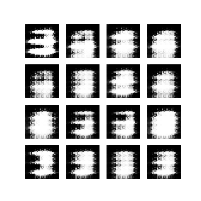

# MNIST-GANs
A simple GAN (Generative Adversarial Network) for generating MNIST digits using TensorFlow.

### GANs overview
Generative Adversarial Networks (GANs) belongs to the generative models. That means they are able to generate artificial content base on the arbitrary input. 

Generally, GANs most of the time refers to the training method, rather on the generative model. Reason for this is that GANs don't train a single network, but instead two networks simultaneously.

The first network is usually called _Generator_, while the second _Discriminator_. Purpose of the Generator model is to images that look real. During training, the Generator progressively becomes better at creating images that look real. Purpose of the Discriminator model is to learn to tell real images apart from fakes. During training, the Discriminator progressively becomes better at telling fake images from real ones. The process reaches equilibrium when the Discriminator can no longer distinguish real images from fakes.

This repo demonstrates how GANs work with simple generative and discriminative networks.  The MNIST dataset represents is a reference for the generative model.

### Models
##### Generator
The Generator model does upsampling to produces images from random noise. It takes random noise as an input, then upsamples several times until reach desired image size (in this case 28x28x1).

```python
model = keras.Sequential([
        layers.Dense(units=7 * 7 * 256, use_bias=False, input_shape=(GEN_NOISE_INPUT_SHAPE,)),
        layers.BatchNormalization(),
        layers.LeakyReLU(),
        layers.Reshape((7, 7, 256)),

        layers.Conv2DTranspose(filters=128, kernel_size=(5, 5), strides=(1, 1), padding="same", 
                               use_bias=False),
        layers.BatchNormalization(),
        layers.LeakyReLU(),

        layers.Conv2DTranspose(filters=64, kernel_size=(5, 5), strides=(2, 2), padding="same", 
                               use_bias=False),
        layers.BatchNormalization(),
        layers.LeakyReLU(),

        layers.Conv2DTranspose(filters=1, kernel_size=(5, 5), strides=(2, 2), padding="same", 
                               use_bias=False, activation="tanh"),
    ])
```

##### Discriminator
The Discriminator is a simple CNN-based image classifier. It outputs positive values for real images, and negative values for fake images.

```python
    model = keras.Sequential([
        layers.Conv2D(filters=64, kernel_size=(5, 5), strides=(2, 2), padding='same', 
                      input_shape=[28, 28, 1]),
        layers.LeakyReLU(),
        layers.Dropout(rate=0.3),

        layers.Conv2D(filters=128, kernel_size=(5, 5), strides=(2, 2), padding='same'),
        layers.LeakyReLU(),
        layers.Dropout(rate=0.3),

        layers.Flatten(),
        layers.Dense(units=1),
    ])
```

### Training results
Training has done on 1k epochs. Bellow are examples during this process.

#### 1 epoch


#### 500 epoch


#### 1000 epoch
